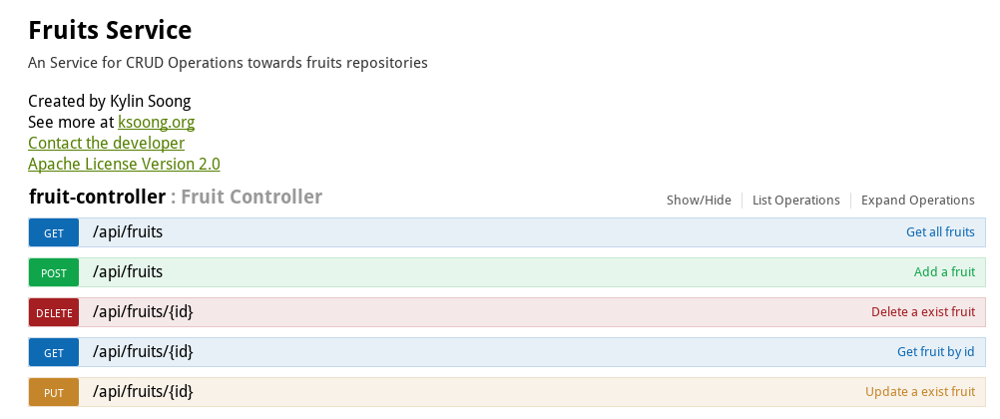

== 快速开始

[source, text]
.*1. 本地测试*
----
$ mvn spring-boot:run

$ curl http://localhost:8080/api/fruits
[{"id":1,"name":"Cherry"},{"id":2,"name":"Apple"},{"id":3,"name":"Banana"}]

$ curl http://localhost:8080/api/fruits/1
{"id":1,"name":"Cherry"}
----

*2. 查看 API 文档*

* 文档链接 - http://localhost:8080/api/swagger.json
* UI 链接 - http://localhost:8080/swagger-ui.html

[source, text]
.*3. 部署到 OpenShift*
----
$ oc login https://master.cmcc.com:8443 -u admin -p admin
$ oc new-project rhoar-spring

$ mvn package fabric8:deploy -Popenshift

$ curl http://fruits-rhoar-spring.apps.cmcc.com/api/fruits
[{"id":1,"name":"Cherry"},{"id":2,"name":"Apple"},{"id":3,"name":"Banana"}]

$ curl http://fruits-rhoar-spring.apps.cmcc.com/api/fruits/1
{"id":1,"name":"Cherry"}
----

